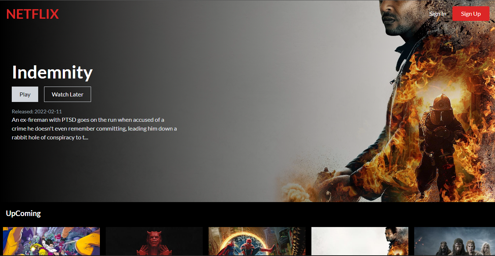

# Netflix clone

Netflix clone build with React, Tailwind CSS, Firebase backend, use the TMDB API for all of the data, use Firebase Authentication to give login and register and  use Firestore which is cloud storage with Firebase to save data.

## Screenshot


## Installation
Clone project 
```
  git clone https://github.com/Brayanro/Netflix-clone.git
```

Install dependencies
```
  yarn install or npm install
```

Run proyect in development
```
  yarn start or npm run start
```